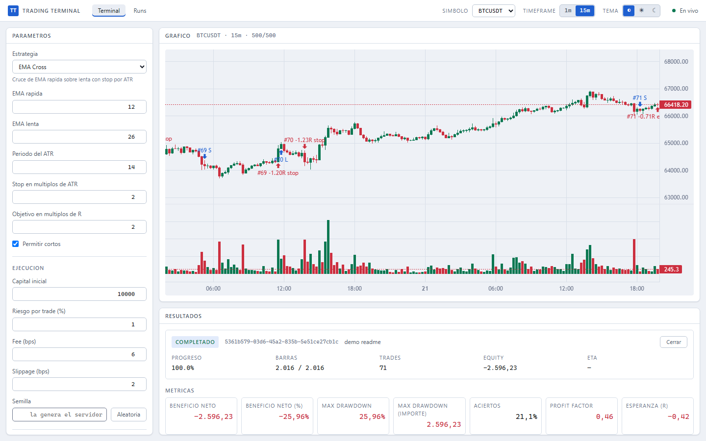
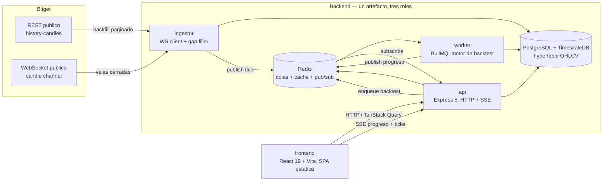

# Trading Terminal — motor de backtesting

[](https://github.com/Luis-Git-AC/trading-terminal_backtesting-engine/actions/workflows/ci.yml)
[](https://github.com/Luis-Git-AC/trading-terminal_backtesting-engine/actions/workflows/e2e.yml)

Terminal de análisis para futuros perpetuos: ingesta de velas reales (histórica + en vivo),
almacenamiento en una hypertable de TimescaleDB, y un motor de backtesting determinista que
ejecuta estrategias parametrizables sobre ese histórico, con progreso en tiempo real y
comparación de runs.



_Captura real contra el stack de la sección "Cómo ejecutarlo en local", con el fixture de
`BTCUSDT` incluido en el repo — no es un mockup._

**Despliegue público**: pendiente. Fue una decisión explícita durante la fase 6 dejar fuera el
deploy en Railway/Vercel para poder cerrar primero E2E, CI y esta documentación con evidencia
real; ver "Limitaciones conocidas" al final. Todo lo de aquí arriba se ejecuta y se verifica en
local con los 5 comandos de más abajo.

## Sobre este proyecto

Se ha diseñado y construido con [Claude Code](https://claude.com/claude-code) (Anthropic), con un
flujo de trabajo dirigido por tickets: un roadmap de 6 fases (datos y backfill → ingesta en vivo →
motor de backtest → API y worker → frontend → E2E/CI/docs), cada una cerrada por un _phase gate_
que se ejecuta de verdad antes de abrir la siguiente, y cada ticket con criterios de aceptación
verificables por comando, no por impresión. Un ejemplo concreto de por qué eso importa: el
primer _push_ real a GitHub Actions (detalle en ["Determinismo y garantías"](#determinismo-y-garantías) más abajo) hizo aparecer una
condición de carrera real en la suscripción SSE que 1.119 tests locales no habían detectado, y que
solo se manifestaba bajo la contención de CPU de un runner de CI — se reprodujo con un test
dedicado antes de tocar el código, y se corrigió con esa reproducción como referencia. Este README
documenta la lógica y las decisiones del sistema tal como quedaron, no un caso de uso comercial.

## Restricción de producto: read-only y paper trading

> **Nunca se ejecutan órdenes reales.** Ninguna clave del exchange usada aquí tiene permiso de
> trading: solo se consumen endpoints públicos de solo lectura (velas históricas y en vivo). No
> hay gestión de cuenta, ni balance, ni envío de órdenes en ningún punto del sistema. Es una
> decisión de producto, no una limitación temporal: elimina la superficie de daño por completo.

## Arquitectura



Cuatro procesos. `api`, `ingestor` y `worker` son el **mismo artefacto de Node**, arrancado con un
`START_MODE` distinto (`api` \| `ingestor` \| `worker`): mismo código, mismas migraciones, tres
procesos independientes en tiempo de ejecución.

| Proceso      | Responsabilidad                                                                           | Por qué está separado                                                                            |
| ------------ | ----------------------------------------------------------------------------------------- | ------------------------------------------------------------------------------------------------ |
| **api**      | HTTP REST + endpoints SSE. No ejecuta el motor ni mantiene sockets al exchange            | Debe responder rápido y poder escalar horizontalmente sin duplicar conexiones al exchange        |
| **ingestor** | Cliente WebSocket persistente hacia Bitget, backfill REST, detección y relleno de huecos  | Una sola conexión WS por clúster, no por instancia de API. Vida larga, reconexión, estado propio |
| **worker**   | Consume la cola `backtest` de BullMQ, ejecuta el motor, persiste el run, publica progreso | Un backtest de cientos de miles de velas bloquearía el _event loop_ del API si corriera ahí      |
| **frontend** | SPA estática (React + Vite)                                                               | Sin necesidad de servidor propio; habla con `api` por HTTP y SSE                                 |

Diagramas ampliados (incluida la secuencia completa de lanzar un backtest): [`docs/diagrams/architecture.md`](docs/diagrams/architecture.md).

### ¿Por qué un worker separado?

Node ejecuta JavaScript en un único hilo. Un backtest de cientos de miles de velas dentro del
proceso del API bloquearía el _event loop_: mientras corre, ningún otro request se atiende. Sacarlo
a un worker que consume una cola (BullMQ sobre Redis) da, gratis, cuatro cosas que un
`worker_threads` dentro del propio API no da: **progreso observable** (el worker publica avance por
Redis pub/sub, el API lo reenvía por SSE), **cancelación**, **reintentos** si el proceso muere a
mitad de un run, y la posibilidad de **escalar el cómputo sin escalar el API** — más instancias de
`worker` cuando hay cola, sin tocar la capa HTTP. El coste es real y se acepta explícitamente: tres
servicios que desplegar y observar en vez de uno, y Redis pasa a ser una dependencia con la que
contar (aunque el API degrada a "sin cache" y el ingestor a "sin publish" si Redis cae, no se
caen ellos).

### ¿Por qué el backend no está en Vercel?

El `ingestor` mantiene una conexión WebSocket **persistente** hacia el exchange, y el `worker`
ejecuta trabajo de **larga duración** (segundos a minutos por backtest). Ninguna de las dos cosas
es compatible con un modelo de ejecución _serverless_ por request, que además facturaría o cortaría
la conexión antes de que termine. Por eso el backend entero (`api` + `worker` + `ingestor`) está
pensado para un proceso de vida larga (Railway en el diseño original de despliegue), y solo el
frontend —una SPA estática sin estado— encaja en Vercel.

## Decisiones de datos

- **Hypertable de TimescaleDB** sobre `candles`, particionada por tiempo (`chunk_time_interval` de
  7 días) — el caso de uso es casi siempre "rango temporal de una serie concreta, en orden", y es
  exactamente lo que una _time-series database_ optimiza. Si el Postgres del entorno no ofrece la
  extensión, el mismo esquema cae a una tabla particionada por rango mensual con índice BRIN sobre
  `ts`: los repositorios no cambian, solo la query de agregados (`time_bucket` → `date_trunc`).
- **Clave primaria compuesta** `(exchange, symbol, timeframe, ts)` — una vela se identifica por su
  serie y su instante de apertura, nunca por un id autoincremental que no significa nada fuera de
  esta base de datos.
- **Upsert idempotente**: toda escritura de velas pasa por
  `INSERT … ON CONFLICT (exchange, symbol, timeframe, ts) DO UPDATE`. La misma vela puede llegar
  por REST (backfill) y por WebSocket (en vivo) casi a la vez; la última escritura de una vela
  **cerrada** es la que vale, y no hay forma de duplicar una fila.
- **Gap-filling**: al reconectar el WebSocket se consulta el último `ts` persistido por serie y se
  rellena por REST el intervalo `[último_ts, ahora]`. Un job periódico audita además huecos que no
  vinieron de un corte de conexión (`ingest_gaps`), y si el propio exchange no tiene ese dato, se
  registra como tal (`no-data-upstream`) en vez de inventarse una vela.

## Determinismo y garantías

"Mismo input + mismo seed → mismo output, byte a byte" es una afirmación que el CI comprueba, no
una promesa:

- El motor (`backend/src/engine/**`) es **puro**: sin `fetch`, sin `pg`, sin `Date.now()`, sin
  `Math.random()`, sin `process.env`. El tiempo entra como dato (los timestamps de las velas) y la
  única aleatoriedad permitida es un PRNG `mulberry32` sembrado con el `seed` del run, que se
  persiste y se muestra en la UI.
- Una señal en la vela `i` se ejecuta al **`open` de la vela `i+1`**, nunca al cierre de la vela que
  la generó — es la diferencia entre un backtest honesto y uno con _look-ahead bias_ que infla los
  resultados sin que se note.
- El CI ejecuta dos comprobaciones sobre esto en cada push: un test que compara el `sha256` del
  resultado serializado de la misma simulación ejecutada dos veces, y otro que escanea el código
  del motor buscando las fuentes de impureza de arriba. Cualquiera de las dos rompe el build si
  falla, igual que si la cobertura de `backend/src/engine/**` baja del 90 % de líneas / 85 % de
  ramas.
- Esa disciplina de "verificar antes de afirmar" no se quedó en la teoría del motor: el primer
  _push_ real a Actions hizo fallar de forma intermitente el flujo de reproducibilidad del E2E. La
  causa no estaba en el determinismo del motor, sino en la ruta SSE — se suscribía al canal de
  Redis _después_ de comprobar si el run ya había terminado, y Redis no reproduce mensajes
  publicados antes de que exista el suscriptor. Bajo la contención de CPU de un runner de GitHub
  Actions esa ventana se ensanchaba lo suficiente para perder el evento `done` y dejar al cliente
  esperando para siempre. Se reprodujo primero con un test que fuerza esa misma ventana de forma
  determinista, y solo entonces se corrigió: la ruta ahora se suscribe **antes** de confiar en el
  estado leído. Detalle completo en el diagrama de secuencia de
  [`docs/diagrams/architecture.md`](docs/diagrams/architecture.md#lanzar-un-backtest-de-punta-a-punta).

## Cómo ejecutarlo en local

Requisitos: Node 22 (fijado en `.nvmrc` y `engines`) y Docker con Compose.

```bash
cp .env.example .env
npm install
npm run db:up
npm run db:migrate
npm run dev
```

`npm run dev` levanta `api` (puerto 4000), `worker` y el frontend de Vite (puerto 5173) en
paralelo. La base de datos empieza vacía: `npm run db:seed -- --all` la llena con velas sintéticas
deterministas en segundos sin tocar la red, o `npm run backfill -- --symbol BTCUSDT --timeframe 15m --from 2026-01-01`
trae histórico real de Bitget.

Estas cinco líneas están probadas en un clon limpio del repositorio (`npm install` desde cero,
`typecheck`/`lint`/`build` en verde, `db:migrate` idempotente contra una base ya migrada, y
`/api/health` respondiendo `{"status":"ok"}`), no solo copiadas de una nota.

Para correr los tests:

```bash
npm run test          # unit + integracion (Postgres/Redis reales, via npm run db:up)
npm run test:engine   # solo el motor: rapido, sin Docker
npm run e2e:up && npm run test:e2e && npm run e2e:down   # los 5 flujos en Playwright
```

## Estructura del repositorio

```
trading-terminal/
├─ README.md
├─ docs/
│  ├─ diagrams/architecture.md   # diagramas Mermaid ampliados
│  └─ assets/                    # capturas usadas en este README
├─ shared/                # @tt/shared — tipos y esquemas Zod comunes a backend y frontend
│  └─ src/
├─ backend/
│  └─ src/
│     ├─ api/             # Express: rutas, middlewares, SSE
│     ├─ worker/          # processors de BullMQ
│     ├─ ingest/          # backfill REST + WS en vivo + gap filling
│     ├─ engine/          # motor de backtest puro, sin I/O
│     ├─ strategies/      # estrategias parametrizables (ema-cross, range-breakout)
│     ├─ db/              # pool, migraciones, repositorios
│     ├─ queue/           # colas BullMQ y pub/sub de Redis
│     ├─ roles/           # composicion de cada START_MODE (api/worker/ingestor)
│     └─ config/          # carga y validacion de env con Zod
├─ frontend/
│  └─ src/                # pages/ components/ hooks/ api/ styles/
├─ e2e/                   # specs de Playwright + fixture real + emisor local de velas
├─ scripts/               # setup del entorno E2E
└─ .github/workflows/     # ci.yml (unit + int + build) y e2e.yml (stack aislado + Playwright)
```

La documentación de proceso (PRD, arquitectura completa, ADRs, roadmap ticket a ticket y el
histórico vivo de decisiones y hallazgos) se mantuvo como material de planificación interno
durante el desarrollo y no forma parte de este repositorio público; lo que responde a "cómo está
hecho y por qué" para quien lee desde fuera es este README y los diagramas de `docs/`.

## Limitaciones conocidas y qué haría a continuación

Explícitas a propósito — ocultarlas sería peor que tenerlas:

- **Sin deploy público todavía.** Railway (API/worker/ingestor) y Vercel (frontend) quedaron fuera
  de esta fase por decisión explícita, para cerrar primero E2E, CI y esta documentación con
  evidencia real en vez de repartir el esfuerzo. El backend ya está preparado para ese deploy
  (`START_MODE` selecciona el rol, health checks, migraciones con _advisory lock_ al arrancar).
- **Un solo exchange y un solo par** (`BTCUSDT` en Bitget) — la arquitectura no impone ese límite
  (`SYMBOLS`/`TIMEFRAMES` son configuración), pero el MVP no expone más.
- **Sin margen ni liquidación.** El motor simula PnL sobre una posición con tamaño por riesgo, sin
  modelar cuenta apalancada, _funding_ ni liquidación forzosa.
- **Sin optimización de parámetros** (grid search, walk-forward). Cada run es una ejecución con un
  conjunto de parámetros fijo; compararlos es manual.
- **`checks.ingest` del endpoint de salud nunca se rellena**: la función que calcula el estado del
  ingestor existe y está testeada, pero ningún rol se la pasa al router de salud todavía —
  requiere decidir cómo comparte el ingestor su estado con el API (candidato: Redis).
- **El panel de progreso puede quedarse con el último dato parcial tras completar un run** si el
  evento SSE final llega en un orden concreto — cosmético (las métricas guardadas son siempre
  correctas; recargar la página lo corrige), encontrado por la suite E2E y sin arreglar todavía.

Con más tiempo, en este orden: cerrar el deploy público en Railway y Vercel, rellenar el estado de
ingesta en `/api/health`, y luego el resto de lo que quedó fuera a propósito desde el diseño —
multi-exchange, alertas, optimización de parámetros — que nunca fue el objetivo de este proyecto,
que es demostrar un pipeline de datos en tiempo real, cómputo pesado fuera del ciclo de request, y
un dominio con reglas propias bien modelado, no una plataforma de trading completa.
