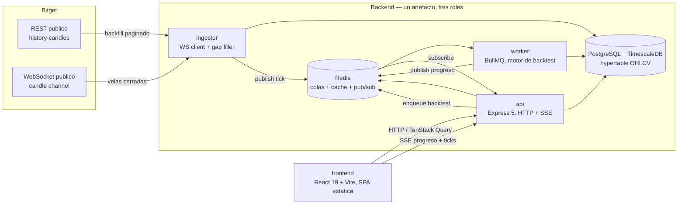
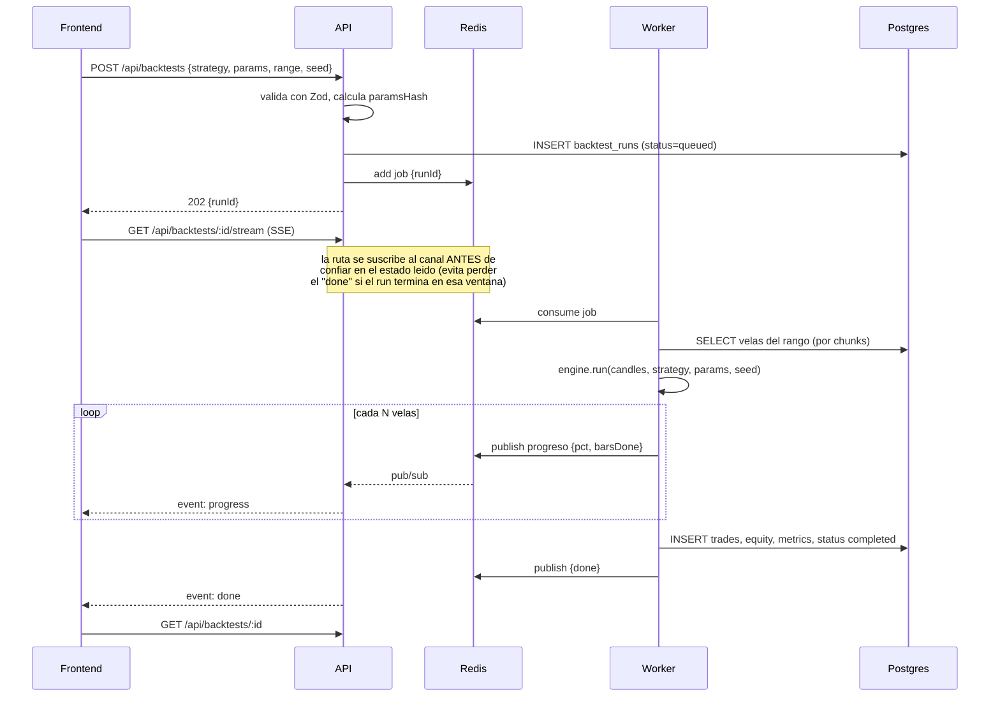

# Arquitectura — diagramas

Complementa la vista general del [README](../../README.md). Dos diagramas: los procesos y sus
dependencias, y la secuencia completa de lanzar un backtest de punta a punta.

## Procesos y flujo de datos

`api`, `ingestor` y `worker` son el mismo artefacto de Node arrancado con un `START_MODE` distinto
(`api` \| `ingestor` \| `worker`) — mismo código, mismas migraciones, tres procesos independientes.
El porqué de esta separación está en el README, sección "¿Por qué un worker separado?".

## Lanzar un backtest, de punta a punta

La nota sobre la suscripción no es cosmética: es un defecto real que se coló hasta el primer
`push` a GitHub Actions (ver "Determinismo y garantías" en el README) y que solo se manifestaba
bajo la contención de CPU de un runner de CI, nunca en local.
